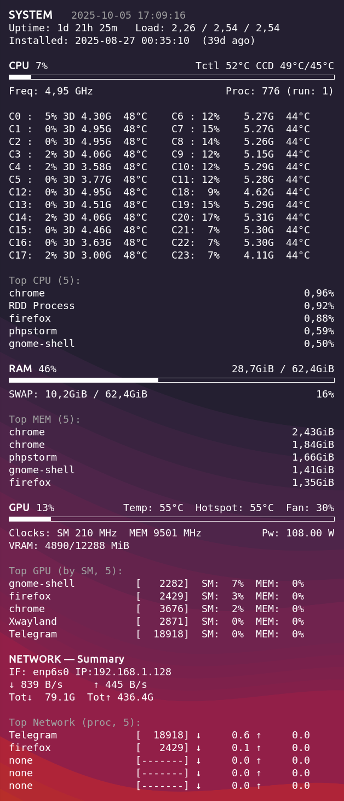

# SystemStats Conky Dashboard

SystemStats is a carefully curated Conky dashboard that turns a plain desktop into an at–a-glance control centre. It surfaces real–time metrics for CPU, GPU, memory, network and the most demanding processes while keeping the layout dense, tidy and flicker–free. The project grew out of a “personal status HUD” and is now documented so that anyone—from a seasoned Linux tinkerer to a brand‑new user—can reproduce the same setup.

<p align="center">
  
</p>


> **Tip**: the preview screenshot was captured on Arch Linux with an AMD Ryzen CPU, NVIDIA GPU and i3 window manager. The configuration is generic enough to run on any Xorg/Wayland desktop once the dependencies below are in place.

---

## Table of Contents

1. [Feature Highlights](#feature-highlights)
2. [Project Layout](#project-layout)
3. [Supported Platforms](#supported-platforms)
4. [Dependencies](#dependencies)
5. [Installation](#installation)
6. [Running Conky](#running-conky)
7. [Autostart on Login](#autostart-on-login)
8. [Configuration Reference](#configuration-reference)
   - [Conky widgets](#conky-widgets)
   - [Helper scripts](#helper-scripts)
   - [Environment overrides](#environment-overrides)
9. [Troubleshooting](#troubleshooting)
10. [Contributing](#contributing)
11. [License](#license)

---

## Feature Highlights

- **System header** – shows current date/time, uptime, load averages and the operating system install date (detected automatically via pacman logs on Arch‐based systems).
- **CPU dashboard**
  - Overall CPU usage bar with temperature summary.
  - Per–core grid with logical core ID, load %, 3D cache marker, live frequency and temperature.
  - Top 5 CPU–hungry processes.
- **GPU dashboard (NVIDIA)**
  - One–line summary with utilisation %, temperatures (core and hotspot), fan speed.
  - Utilisation bar (`execibar`) for quick load scanning.
  - Clock and power draw line plus VRAM usage line.
  - Top 5 GPU workloads (SM utilisation) pulled from `nvidia-smi pmon`.
- **RAM / Swap**
  - Total RAM with percentage bar, swap usage and the top 5 memory consumers.
- **Network**
  - Active interface, IPv4 address, up/down speeds and total transferred bytes.
  - Top 5 bandwidth‐heavy processes (`nethogs` backend) with caching to eliminate flicker.
- **Quality of life**
  - Monospaced layout tuned for 240 px width on a second monitor.
  - Scripts written in POSIX/Bash with graceful fallbacks (no GPU? the GPU section prints placeholders).

---

## Project Layout

```
SystemStats.conkyrc   # Main Conky configuration (text + layout)
scripts/
 ├─ cpu_cores.sh      # Per-core load / frequency / temperature grid
 ├─ cpu_temp.sh       # CPU temperature line (reads hwmon/lm_sensors labels)
 ├─ gpu.sh            # GPU summary generator (header/footer modes)
 ├─ gpu_top.sh        # Top GPU processes (SM utilisation)
 ├─ gpu_util.sh       # Outputs GPU utilisation percentage for the bar
 ├─ net.sh            # Network interface summary
 ├─ net_top.sh        # Top processes by network throughput
 ├─ os_installed.sh   # Detects OS install date (pacman-based systems)
 └─ ...               # Any future modules live here
README.md             # You are here
```

All scripts are invoked through `${execi ...}` or `${execpi ...}` calls in `SystemStats.conkyrc`. They are designed to run fast (<0.5s) so that Conky stays smooth.

---

## Supported Platforms

- **Desktop Environment / WM:** any X11 or Wayland session where Conky can draw. Tested on i3 and GNOME.
- **Distribution:** tuned for Arch Linux and derivatives (Manjaro, EndeavourOS). It will work elsewhere, but `os_installed.sh` will fall back to “unknown” if pacman is absent.
- **Hardware:**
  - CPU: any Linux-supported CPU with `/proc/stat` and `/sys/devices/system/cpu/…` exposed (AMD and Intel verified).
  - GPU: NVIDIA cards with `nvidia-smi`; without it the GPU block shows placeholders.
  - Network: any interface supported by `ip` and `nethogs`.

---

## Dependencies

Below is a comprehensive list of packages you need before launching Conky.

| Component                | Purpose                                    | Arch package            | Debian/Ubuntu equivalent         |
|-------------------------|--------------------------------------------|-------------------------|----------------------------------|
| `conky`                 | Rendering engine                           | `conky`                 | `conky`                          |
| `nvidia-utils`          | Provides `nvidia-smi`                      | `nvidia-utils`          | Part of `nvidia-driver-<version>` / `nvidia-utils-<version>` |
| `nethogs`               | Per-process network stats                  | `nethogs`               | `nethogs`                        |
| `lm_sensors`            | Temperatures via `/sys/class/hwmon`        | `lm_sensors`            | `lm-sensors`                     |
| `iproute2`              | Network interface discovery (`ip`)         | `iproute2` (base)       | `iproute2`                       |
| `procps-ng`, `coreutils`, `awk`, `sed`, `findutils`, `gzip` | Required by scripts | included in base system | included in base system |

### Installing on Arch Linux / Manjaro

```bash
sudo pacman -S --needed conky nvidia-utils nethogs lm_sensors
```

Enable sensors (optional but recommended for accurate per-core temps):

```bash
sudo sensors-detect   # follow prompts, then reboot or run `sudo systemctl restart lm_sensors`
```

### Installing on Debian / Ubuntu

```bash
sudo apt update
sudo apt install conky nethogs lm-sensors nvidia-driver-535
sudo sensors-detect    # optional, enables additional hwmon entries

# Replace `nvidia-driver-535` with the driver version recommended for your GPU (`apt search nvidia-driver`).
```

> **Note:** on Debian-based systems `os_installed.sh` will print “Installed: unknown” because it relies on pacman logs. Feel free to adapt the script for `dpkg` if needed.

---

## Installation

1. **Clone the repository**
   ```bash
   git clone https://github.com/Yudaev/conkysystemstats.git
   cd conkysystemstats
   ```

2. **Make scripts executable** (if not already)
   ```bash
   chmod +x scripts/*.sh
   ```

3. **Verify dependencies**
   ```bash
   conky -v              # confirm Conky is installed
   nvidia-smi -L         # should list your GPU (optional)
   nethogs -V            # prints version
   ```

4. **(Optional) Test helper scripts**
   ```bash
   ./scripts/gpu.sh header
   ./scripts/cpu_cores.sh | head
   ./scripts/net_top.sh   # may require sudo or capabilities for nethogs
   ```

---

## Running Conky

Two common options:

1. **Temporary run from the project folder**
   ```bash
   conky -c ./SystemStats.conkyrc
   ```

2. **Install to your Conky config**
   ```bash
   mkdir -p ~/.config/conky/SystemStats
   cp SystemStats.conkyrc ~/.config/conky/SystemStats/
   cp -r scripts assets ~/.config/conky/SystemStats/
   conky -c ~/.config/conky/SystemStats/SystemStats.conkyrc
   ```

Launch Conky once to ensure all sections populate. GPU and network tables show placeholders (e.g. `none [-------]`) until there is activity.

---

## Autostart on Login

### Systemd user service

```ini
# ~/.config/systemd/user/conky-systemstats.service
[Unit]
Description=Conky SystemStats dashboard

[Service]
ExecStart=/usr/bin/conky -c %h/.config/conky/SystemStats/SystemStats.conkyrc
Restart=on-failure

[Install]
WantedBy=default.target
```

Enable it:

```bash
systemctl --user daemon-reload
systemctl --user enable --now conky-systemstats.service
```

### Desktop environment autostart

Alternatively create `~/.config/autostart/conky-systemstats.desktop` with:

```ini
[Desktop Entry]
Type=Application
Exec=conky -c $HOME/.config/conky/SystemStats/SystemStats.conkyrc
Hidden=false
NoDisplay=false
X-GNOME-Autostart-enabled=true
Name=Conky SystemStats
```

---

## Configuration Reference

### Conky Widgets

`SystemStats.conkyrc` is heavily commented. Key parameters you may want to tweak:

- `alignment`, `gap_x`, `gap_y`, `xinerama_head` – control screen placement.
- `font`, `color1`, `color2` – typography and accent colours.
- `${execi}` intervals – adjust update frequency if you prefer slower refresh.
- `${minimum_width}` – the layout is optimised for 240 px but can be resized.

### Helper Scripts

| Script | Description | Notes |
|--------|-------------|-------|
| `cpu_cores.sh` | Samples `/proc/stat` twice (400 ms apart) to compute per-core load, reads `/sys/.../cpufreq` for frequency, and `/sys/class/hwmon` for temps. Marks cores belonging to 3D cache with `3D`. | `CELLW`, `GROUP`, `COLS` env vars can tune layout. |
| `cpu_temp.sh` | Outputs CPU temperature metrics (uses `hwmon` sensors). | Falls back gracefully if labels are missing. |
| `gpu.sh` | Main GPU summary. Accepts optional argument `header` or `footer` so Conky can place text around the load bar. | Requires `nvidia-smi`. |
| `gpu_top.sh` | Collects GPU process stats via `nvidia-smi pmon`, sorts by SM utilisation, always prints 5 rows (with placeholders). | |
| `gpu_util.sh` | Simple helper printing GPU utilisation as an integer for `${execibar}`. | |
| `net.sh` | Finds the active interface via `ip route`, prints IP, speeds, cumulative totals. | |
| `net_top.sh` | Uses `nethogs` with caching to avoid flicker; sorts per-process traffic, outputs 5 rows. | Needs `nethogs` CAP_NET_ADMIN permissions (`sudo setcap 'cap_net_admin,cap_net_raw,cap_dac_read_search,cap_sys_ptrace+ep' /usr/bin/nethogs`). |
| `os_installed.sh` | Detects earliest package installation (Arch pacman logs) and prints “Installed: … (… ago)”. | Optional; prints `Installed: unknown` on non-pacman systems. |

### Environment Overrides

Several scripts read environment variables to adjust formatting without editing code:

- `cpu_cores.sh`
  - `COLS`, `CELLW`, `GROUP` – change grid dimensions.
  - `COLLECT_DELAY` – override sampling delay (default 0.4 seconds).
- `net_top.sh`
  - `LINES` – number of entries (default 5).
  - `CACHE` – override cache file path (`/tmp/systemstats_net_top.cache`).
  - `MAX_AGE` – refresh interval in seconds (default 3).
- `gpu_top.sh`
  - `LINES` – number of GPU processes to show (default 5).

Export these before launching Conky (e.g., in `~/.profile`) to customise behaviour.

---

## Troubleshooting

| Symptom | Cause / Fix |
|---------|-------------|
| GPU section prints “GPU: NVIDIA не обнаружена” | `nvidia-smi` missing. Install appropriate NVIDIA utilities or hide the section by commenting it out in `SystemStats.conkyrc`. |
| Network top always shows `none` | `nethogs` requires elevated capabilities. Run `sudo setcap 'cap_net_admin,cap_net_raw,cap_dac_read_search,cap_sys_ptrace+ep' /usr/bin/nethogs`. |
| Temperatures show `--°C` | `lm_sensors` not configured or your hardware exposes different labels. Run `sensors-detect` or edit `cpu_cores.sh` fallback logic. |
| `os_installed.sh` prints “Installed: unknown” | You are not on a pacman-based distro. Either ignore the line or extend the script to parse `dpkg`/`rpm` metadata. |
| Conky flickers/updates slowly | Increase `${update_interval}` in `SystemStats.conkyrc`, or adjust `${execi}` intervals to longer periods. |

---

## License

This project is released under the MIT License. See [`LICENSE`](LICENSE) for the full text.

Happy monitoring! If you build something cool on top of SystemStats, share a screenshot or open a pull request—community improvements are highly appreciated.
